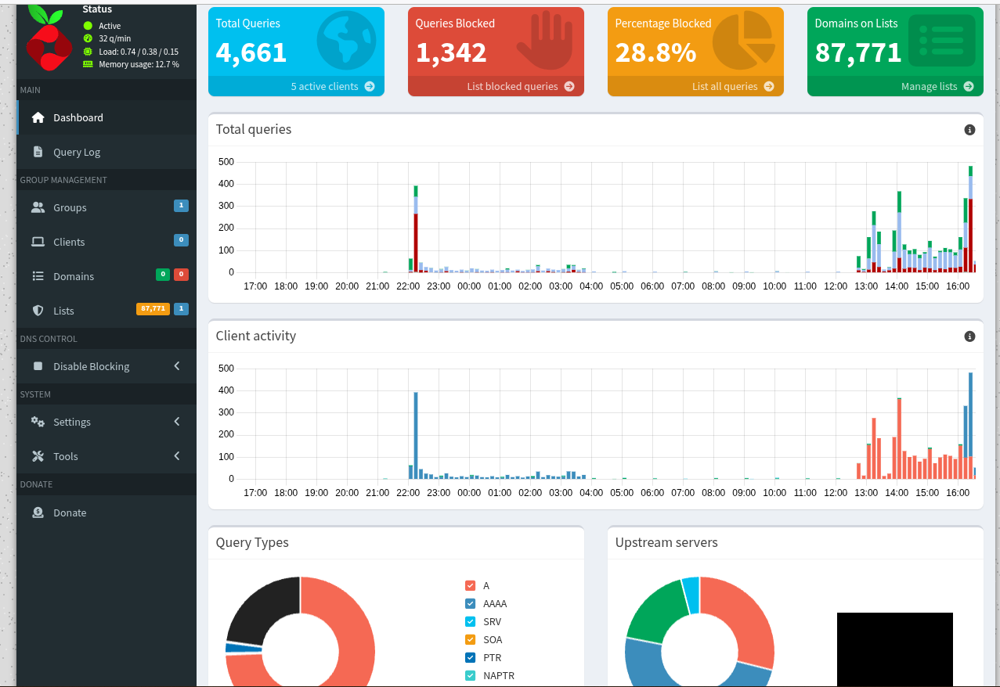

# Pi-hole
# 🛡️ Pi-hole on Docker: Network-wide Protection

Dieses Projekt dokumentiert die Einrichtung eines zentralen DNS-Sinkholes in meinem Heimnetzwerk. Ziel ist es, Werbung und Tracking-Domains bereits auf DNS-Ebene zu blockieren, um die Privatsphäre zu schützen und die Netzwerklast zu reduzieren.

## 🚀 Key Features
- **Hardware-Effizienz:** Optimierter Betrieb auf einem Raspberry Pi 5.
- **Containerisierung:** Bereitstellung via Docker für einfache Wartung und Updates.
- **Privacy First:** Blockierung von Telemetrie-Daten diverser IoT-Geräte und Betriebssysteme.
- **Performance:** Deutlich schnellere Ladezeiten durch Unterdrückung von Werbe-Content.

## 📊 Dashboard & Monitoring
Hier ist ein aktueller Einblick in mein Dashboard:



*Hinweis: Zur Wahrung der Netzwerksicherheit wurden die Upstream-DNS-Server im Screenshot anonymisiert.*

## 🛠️ Tech Stack
- **Hardware:** Raspberry Pi 5 (8GB RAM)
- **Host OS:** Raspberry Pi OS (64-bit)
- **Virtualisierung:** Docker & Docker Compose
- **Network:** Statische IP-Konfiguration im lokalen LAN

## ⚙️ Deployment (Docker Compose)
Ich nutze ein standardisiertes `docker-compose.yml` Setup, um Persistenz und einfache Skalierbarkeit zu gewährleisten.

```yaml
version: "3"
services:
  pihole:
    container_name: pihole
    image: pihole/pihole:latest
    ports:
      - "53:53/tcp"
      - "53:53/udp"
      - "80:80/tcp"
    environment:
      TZ: 'Europe/Berlin'
      WEBPASSWORD: 'REDACTED'
    volumes:
      - './etc-pihole:/etc/pihole'
      - './etc-dnsmasq.d:/etc/dnsmasq.d'
    restart: unless-stopped
