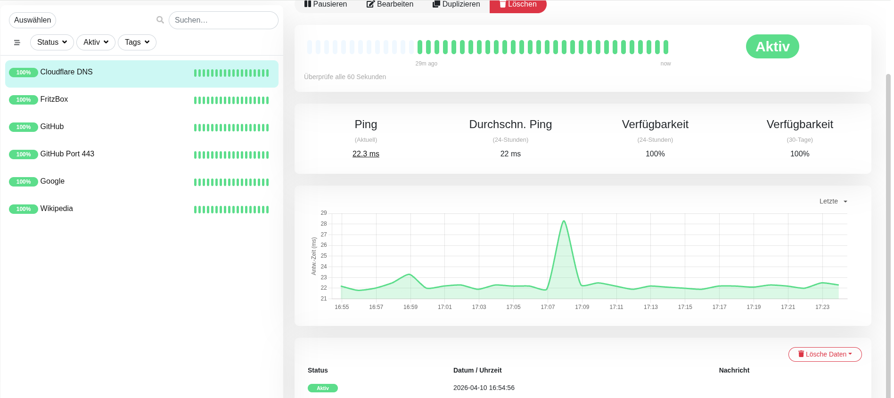
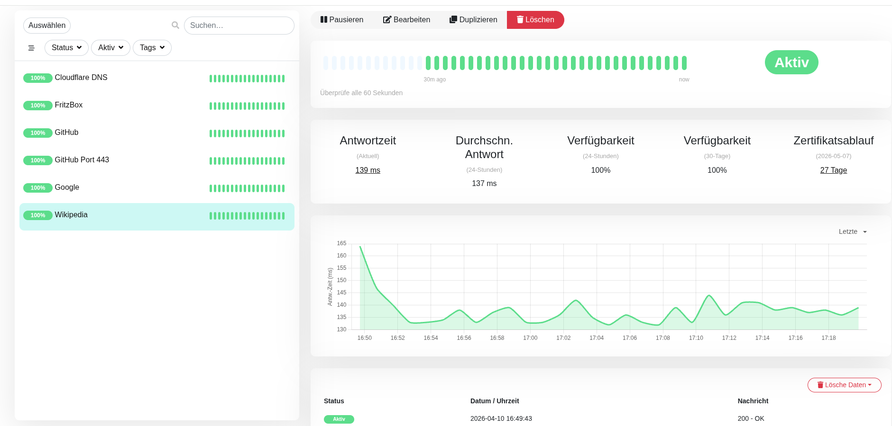
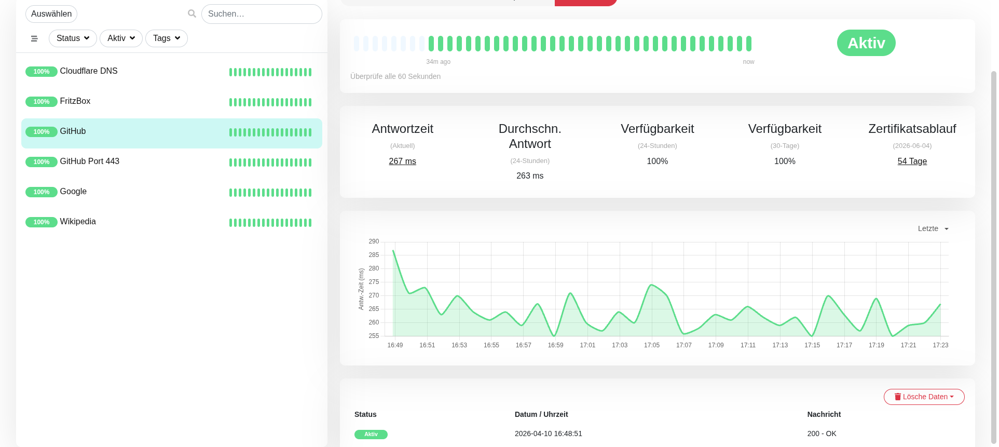
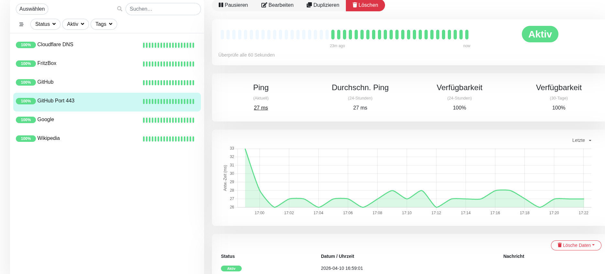
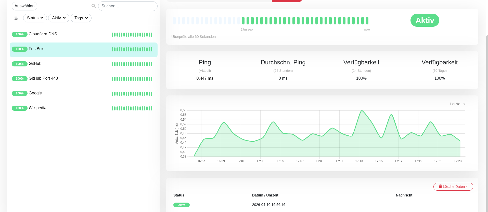

# Uptime Kuma Monitoring Project

Dieses Repository dient als Dokumentation und Erweiterungsprojekt für meine Uptime‑Kuma‑Installation.

## Inhalt
- Erste Schritte mit Uptime Kuma
- Beispielmonitor (Google)
- Screenshots
- Geplante Automatisierungen

## Beispielmonitor
Ich habe als ersten Test den Google‑Monitor eingerichtet, um die Funktionalität zu prüfen.

### Screenshot

## Roadmap
- [ ] Weitere Monitore hinzufügen
- [ ] Setup‑Dokumentation erstellen
- [ ] Backup‑Automatisierung integrieren
- [ ] GitHub Actions für regelmäßige Checks

## Ziel
Ein vollständiges, nachvollziehbares Monitoring‑Projekt, das sowohl Lernzwecken als auch praktischer Nutzung dient.

## 📊 Monitore

Ich überwache aktuell folgende Dienste:

- Google (HTTP)
- Cloudflare (HTTP)
- Wikipedia (HTTP)
- GitHub (HTTP)
- GitHub Port 443 (Port-Check)
- FritzBox (Ping)

## 📸 Screenshots

### Google Monitor

*Zeigt die Erreichbarkeit und Antwortzeit von google.com.*

### Cloudflare Monitor

*HTTP-Check auf cloudflare.com.*

### Wikipedia Monitor

*Überwachung der Wikipedia-Startseite.*

### GitHub Monitor

*HTTP-Status von github.com.*

### GitHub Port 443

*Port-Check auf HTTPS-Port 443.*

### FritzBox Ping

*Ping-Monitor zur lokalen FritzBox.*
